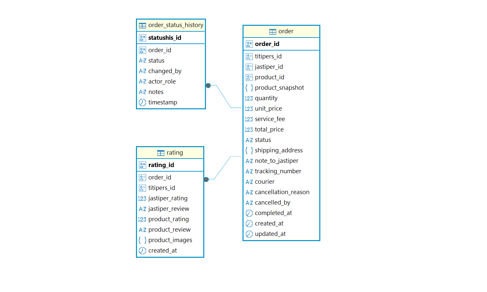
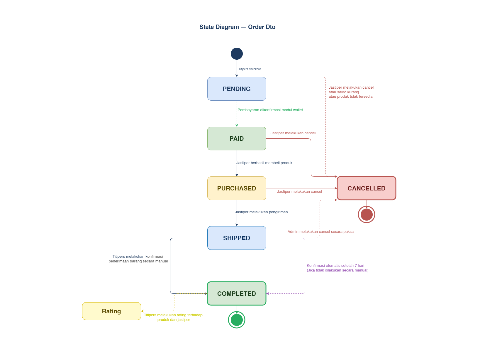

# Modul 3 : Order & War Engine (json-order-service)

Microservice untuk mengelola **Modul Order & War Engine** pada platform JaStip Online Nasional (JSON).

## Tanggung Jawab Modul

Modul ini bertindak sebagai orkestrator transaksi — menangani seluruh siklus hidup pesanan mulai dari checkout hingga selesai, sekaligus mengelola mekanisme war (flash sale) untuk barang limited edition.
---

## Yang Dilakukan Modul Ini

### TODO
- TODO
  ```
  TODO
  ```

### TODO
- TODO


---


## Tech Stack

- **Rust** + **Axum** — web framework
- **SQLx** — database driver + auto migration
- **PostgreSQL** (Neon DB) — penyimpanan data


---


## Database Schema

### Custom Types

#### `order_status`
| Value       |
|-------------|
| PENDING     |
| PAID        |
| PURCHASED   |
| SHIPPED     |
| COMPLETED   |
| CANCELLED   |

### `cancelled_by_enum`
| Value    |
|----------|
| JASTIPER |
| ADMIN    |

---

### Table: `Order`

| Field               | Type                  | Nullable | Key |
|---------------------|-----------------------|----------|-----|
| order_id            | UUID (string)         | NOT NULL | PK  |
| titipers_id         | UUID (string)         | NOT NULL | FK  |
| jastiper_id         | UUID (string)         | NOT NULL | FK  |
| product_id          | UUID (string)         | NOT NULL | FK  |
| product_snapshot    | JSON                  | NOT NULL |     |
| quantity            | INTEGER               | NOT NULL |     |
| unit_price          | INTEGER               | NOT NULL |     |
| service_fee         | INTEGER               | NOT NULL |     |
| total_price         | INTEGER               | NOT NULL |     |
| status              | order_status          | NOT NULL |     |
| shipping_address    | JSON                  | NOT NULL |     |
| note_to_jastiper    | VARCHAR               | NULL     |     |
| tracking_number     | VARCHAR               | NULL     |     |
| courier             | VARCHAR               | NULL     |     |
| cancellation_reason | VARCHAR               | NULL     |     |
| cancelled_by        | cancelled_by_enum     | NULL     |     |
| status_history      | JSON ARRAY            | NOT NULL |     |
| completed_at        | DATETIME (ISO 8601)   | NULL     |     |
| created_at          | DATETIME (ISO 8601)   | NOT NULL |     |
| updated_at          | DATETIME (ISO 8601)   | NOT NULL |     |

**PK:** order_id — auto-generated.

**FK:**
- titipers_id → tabel users (pembeli)
- jastiper_id → tabel users (pemilik produk)
- product_id → tabel products (referensi saja; data asli disimpan di product_snapshot)


**Notes:**
- total_price → Dihitung otomatis: (unit_price + service_fee) × quantity.
- status → Tipe order_status. Nilai yang diizinkan: PENDING, PAID, PURCHASED, SHIPPED, COMPLETED, CANCELLED.
- cancelled_by → Tipe cancelled_by_enum. Nilai yang diizinkan: JASTIPER, ADMIN. Bernilai NULL jika tidak dibatalkan.
- tracking_number, courier → Diisi saat status berubah menjadi SHIPPED.
- cancellation_reason, cancelled_by → Diisi saat status berubah menjadi CANCELLED.
- completed_at → Diisi saat status berubah menjadi COMPLETED, bernilai NULL sebelumnya.

---

### Object: `ProductSnapshot`

Salinan immutable data produk yang disimpan di dalam setiap order saat checkout.

| Field          | Type            | Nullable | Key |
|----------------|-----------------|----------|-----|
| product_id     | UUID (string)   | NOT NULL | PK  |
| name           | VARCHAR         | NOT NULL |     |
| description    | TEXT            | NOT NULL |     |
| image_url      | VARCHAR         | NOT NULL |     |
| origin_country | VARCHAR         | NOT NULL |     |
| purchase_date  | DATE            | NOT NULL |     |
| unit_price     | INTEGER         | NOT NULL |     |
| service_fee    | INTEGER         | NOT NULL |     |

**PK:** product_id — id dari produk aslinya.

**Notes:**
- Object ini disimpan sebagai JSON di kolom product_snapshot pada tabel orders, bukan tabel terpisah.
- product_id → referensi ke ID produk asli (tidak enforced sebagai FK karena disimpan dalam JSON).

---

### Object: `ShippingAddress`

| Field          | Type    | Nullable | Key |
|----------------|---------|----------|-----|
| recipient_name | VARCHAR | NOT NULL | PK  |
| phone_number   | VARCHAR | NOT NULL | PK  |
| street         | VARCHAR | NOT NULL |     |
| kelurahan      | VARCHAR | NOT NULL |     |
| kecamatan      | VARCHAR | NOT NULL |     |
| city           | VARCHAR | NOT NULL |     |
| province       | VARCHAR | NOT NULL |     |
| postal_code    | VARCHAR | NOT NULL |     |
| notes          | VARCHAR | NULL     |     |

**PK:** (recipient_name, phone_number)

**Notes:**
- Object ini disimpan sebagai JSON di kolom shipping_address pada tabel orders, bukan tabel terpisah.
- postal_code → 5 digit.

---

### Object: `StatusHistory`

Array yang menyimpan seluruh log perubahan status pesanan secara kronologis.

| Field        | Type                | Nullable | Key |
|--------------|---------------------|----------|-----|
| statushis_id | UUID                | NOT NULL | PK  |
| order_id     | UUID                | NOT NULL | FK  |
| status       | order_status        | NOT NULL |     |
| changed_by   | UUID                | NOT NULL |     |
| actor_role   | VARCHAR             | NOT NULL |     |
| notes        | VARCHAR             | NULL     |     |
| timestamp    | DATETIME (ISO 8601) | NOT NULL |     |

**PK:** statushis_id

**FK:** order_id

**Notes:**
- Object ini disimpan sebagai JSON ARRAY di kolom status_history pada tabel orders, bukan tabel terpisah.
- changed_by → user_id aktor, atau nilai SYSTEM jika perubahan otomatis.
- actor_role → Nilai yang diizinkan: TITIPERS, JASTIPER, ADMIN, SYSTEM.

---

### Table: `Rating`

| Field          | Type                | Nullable | Key |
|----------------|---------------------|----------|-----|
| rating_id      | UUID (string)       | NOT NULL | PK  |
| order_id       | UUID (string)       | NOT NULL | FK  |
| titipers_id    | UUID (string)       | NOT NULL | FK  |
| jastiper_rating| FLOAT               | NOT NULL |     |
| jastiper_review| TEXT                | NULL     |     |
| product_rating | FLOAT               | NOT NULL |     |
| product_review | TEXT                | NULL     |     |
| product_images | VARCHAR[]           | NOT NULL |     |
| created_at     | DATETIME (ISO 8601) | NOT NULL |     |

**PK:** rating_id — auto-generated.

**FK:**
- order_id → tabel orders
- titipers_id → tabel users (pemberi rating)


**Notes:**
- jastiper_rating → Skala 1.0–5.0.
- product_rating → Skala 1.0–5.0.
- product_images → Array URL foto produk dari Titipers. Default: [].
---

## ERD


---

## STATE DIAGRAM
