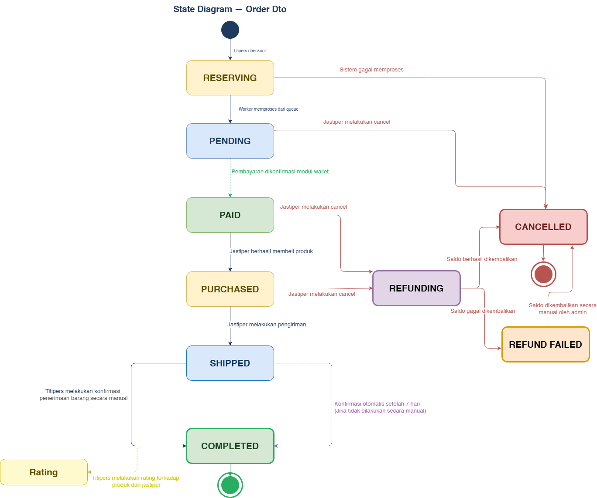

# json-order-service

Microservice for **Order Management & Rating System** on the JaStip Online Nasional (JSON) platform.

Built with **Rust + Axum**, backed by **PostgreSQL** via **SQLx**, and communicates with Inventory, Wallet, and Auth services over HTTP.

---

## Tech Stack

- **Rust** (edition 2024) + **Axum 0.7** — HTTP framework
- **SQLx 0.8** — async PostgreSQL driver with compile-time query checks
- **sea-query 0.32** — type-safe SQL query builder
- **PostgreSQL** — via Neon DB
- **RabbitMQ** (via lapin / deadpool-lapin) — async checkout queue
- **Axum State pattern** — all dependencies injected as `Arc<dyn Trait + Send + Sync>`

---

## Architecture

### Module Responsibilities

| Concern            | Implementation                                |
|--------------------|-----------------------------------------------|
| Order lifecycle    | State machine (`src/models/order_state.rs`)   |
| Rating (product)   | Controller → Service → Repository (separate)  |
| Rating (jastiper)  | Controller → Service → Repository (separate)  |
| Idempotency        | Idempotency key table + repository            |
| Checkout queue     | RabbitMQ publisher + background worker        |
| HTTP clients       | Inventory, Wallet, Auth (all mockable)        |
| Auth               | JWT extraction middleware                     |

### State Machine — Order Status Flow

Each status transition is guarded by role-based rules (SYSTEM, TITIPERS, JASTIPER, ADMIN).

---

## Database Schema

### Table: `"order"`

| Column               | Type                  | Notes                                   |
|----------------------|-----------------------|-----------------------------------------|
| order_id             | UUID (PK)             | `gen_random_uuid()`                     |
| titipers_id          | UUID                  | Buyer                                   |
| jastiper_id          | UUID                  | Seller                                  |
| product_id           | UUID                  | Reference to product                    |
| product_snapshot     | JSONB                 | Immutable product copy at checkout      |
| quantity             | INTEGER               | ≥ 1                                     |
| unit_price           | BIGINT                | Per-item price                          |
| service_fee          | BIGINT                | Platform fee                            |
| total_price          | BIGINT                | (unit_price + service_fee) × quantity   |
| status               | TEXT                  | One of 9 states (see above)             |
| shipping_address     | JSONB                 | Address snapshot                        |
| note_to_jastiper     | TEXT?                 | Optional buyer note                     |
| tracking_number      | TEXT?                 | Set on SHIPPED                          |
| courier              | TEXT?                 | Set on SHIPPED                          |
| cancellation_reason  | TEXT?                 | Set on CANCELLED                        |
| cancelled_by         | TEXT?                 | Role that cancelled                     |
| completed_at         | TIMESTAMPTZ?          | Set on COMPLETED                        |
| created_at           | TIMESTAMPTZ           | `NOW()`                                 |
| updated_at           | TIMESTAMPTZ           | `NOW()`                                 |
| expired_at           | TIMESTAMPTZ           | Auto-cancel deadline                    |

### Table: `"order_status_history"`

| Column       | Type         | Notes                              |
|--------------|--------------|------------------------------------|
| status_his_id| UUID (PK)    |                                    |
| order_id     | UUID (FK)    | → `"order"(order_id)` ON DELETE CASCADE |
| status       | TEXT         | New status                         |
| changed_by   | TEXT         | User ID or "SYSTEM"                |
| actor_role   | TEXT         | TITIPERS / JASTIPER / ADMIN / SYSTEM |
| notes        | TEXT?        | Optional reason                    |
| timestamp    | TIMESTAMPTZ  | `NOW()`                            |

### Table: `"rating_product"`

| Column              | Type         | Notes                                      |
|---------------------|--------------|--------------------------------------------|
| rating_product_id   | UUID (PK)    |                                            |
| order_id            | UUID (FK)    | UNIQUE, → `"order"(order_id)` CASCADE      |
| titipers_id         | UUID         | Reviewer                                   |
| product_rating      | FLOAT8       | 1.0 – 5.0                                  |
| product_review      | TEXT?        | Max 1000 chars                             |
| created_at          | TIMESTAMPTZ  | `NOW()`                                    |

### Table: `"rating_jastiper"`

| Column              | Type         | Notes                                      |
|---------------------|--------------|--------------------------------------------|
| rating_jastiper_id  | UUID (PK)    |                                            |
| order_id            | UUID (FK)    | UNIQUE, → `"order"(order_id)` CASCADE      |
| titipers_id         | UUID         | Reviewer                                   |
| jastiper_rating     | FLOAT8       | 1.0 – 5.0                                  |
| jastiper_review     | TEXT?        | Max 1000 chars                             |
| created_at          | TIMESTAMPTZ  | `NOW()`                                    |

### Table: `idempotency_keys`

| Column       | Type        | Notes                               |
|--------------|-------------|-------------------------------------|
| key          | UUID (PK)   | Idempotency key                     |
| order_id     | UUID (FK)   | → `"order"(order_id)`               |
| processed_at | TIMESTAMPTZ | `NOW()`                             |

---

## API Endpoints

### Order

| Method | Path                                | Handler                   |
|--------|-------------------------------------|---------------------------|
| POST   | `/orders`                           | `checkout`                |
| GET    | `/orders/:order_id`                 | `get_order`               |
| PATCH  | `/orders/:order_id/payment`         | `payment`                 |
| PATCH  | `/orders/:order_id/confirm`         | `confirm_order`           |
| PATCH  | `/orders/:order_id/purchased`       | `purchased`               |
| PATCH  | `/orders/:order_id/shipped`         | `shipped`                 |
| GET    | `/orders/:order_id/history`         | `get_order_history`       |
| POST   | `/orders/:order_id/cancel`          | `cancel_order`            |
| GET    | `/orders/my/purchases`              | `my_purchases`            |
| GET    | `/orders/my/sales`                  | `my_sales`                |

### Rating — Product

| Method | Path                                    | Handler                         |
|--------|-----------------------------------------|---------------------------------|
| POST   | `/orders/:order_id/rating/product`      | `submit_rating_product`         |
| GET    | `/orders/:order_id/rating/product`      | `get_rating`                    |
| GET    | `/products/:product_id/ratings`         | `get_ratings_by_product`        |

### Rating — Jastiper

| Method | Path                                    | Handler                         |
|--------|-----------------------------------------|---------------------------------|
| POST   | `/orders/:order_id/rating/jastiper`      | `submit_rating_jastiper`        |
| GET    | `/orders/:order_id/rating/jastiper`      | `get_rating`                    |
| GET    | `/jastipers/:jastiper_id/ratings`        | `get_ratings_by_jastiper`       |

### Internal (inter-service)

| Method | Path                                                  | Handler                |
|--------|-------------------------------------------------------|------------------------|
| POST   | `/internal/orders/:order_id/refund-confirmed`         | `refund_confirmed`     |

### Admin

| Method | Path                                           | Handler        |
|--------|------------------------------------------------|----------------|
| GET    | `/admin/orders`                                | `get_all`      |
| GET    | `/admin/orders/:order_id`                      | `get_order`    |
| POST   | `/admin/orders/:order_id/force-cancel`         | `force_cancel` |

---

## Testing

Unit tests live in `src/tests/`. All external dependencies are mocked via `mockall`:

| Trait                  | Mock                   |
|------------------------|------------------------|
| `InventoryClient`      | `MockInventoryClient`  |
| `WalletClient`         | `MockWalletClient`     |
| `AuthClient`           | `MockAuthClient`       |
| `CheckoutPublisher`    | `MockCheckoutPublisher`|
| `OrderRepository`      | `MockOrderRepository`  |
| `RatingProductRepository`  | `MockRatingProductRepository` |
| `RatingJastiperRepository` | `MockRatingJastiperRepository` |

Run tests:

```sh
cargo test
```

---

## Running

```sh
# 1. Set environment variables (or copy .env.example)
# 2. Run database migrations (automatic on startup)
cargo run
```

The server listens on `0.0.0.0:8084` by default.
